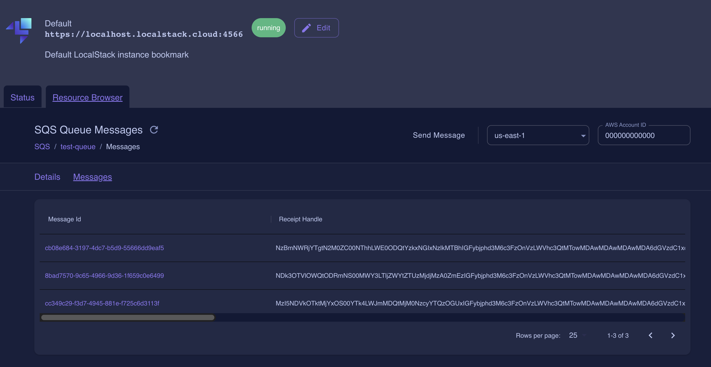

# spring-boot-aws-sqs-integration-example
This project give you a why to configure and integrate with AWS SQS and the means to test this in your local environment with LocalStack

## Local Stack configuration (local)

### Docker Configuration

- [ ] [Download Docker for desktop](https://www.docker.com/products/docker-desktop/)
- [ ] [Steps to configure localstack docker](https://hub.docker.com/r/localstack/localstack)

### Local Stack Commands to create SQS

- Command to create the sqs

```shell
aws --endpoint-url=http://localhost:<<<Replace this with your local stack port>>> sqs create-queue --queue-name test-queue
```

- Validate the creation of the sqs queue

```shell
aws --endpoint-url=http://localhost:<<<Replace this with your local stack port>>> sqs list-queues
```

- You can validate the creation of the queue using the cloud access to local stack in the page  [Local Stack](https://app.localstack.cloud), for this click on Resources and search for SQS, this will list all the created queues. Also, you can create new queues clicking on the option CREATE QUEUE.
- To validate the Messages on the queue

## Modify the properties to Run the application

### SQS Properties

- You need to modify the following properties on the ```application.yml``` file

```properties
sqs:
    queue:
        region: {AWS-local-region}
        url: https://localhost:<<<Replace this with your local stack port>>>/000000000000/test-queue
        arn: {created-sqs-arn}
```

### AWS Properties

- You need to modify the following properties on the ```application.yml``` file

```properties
config:
    aws:
        region:
            static: {AWS-local-region}
        credentials:
            access-key: {AWS-access-key}
            secret-key: {AWS-secret-key}
```

## Validations

To validate that the service is working correctly do:

- Using cURL execute the command, this can also be done in any app that allows you to send REST request like [Postman](https://www.postman.com):

```shell
curl --location 'http://localhost:9080/api/v1/message' \
--header 'Content-Type: application/json' \
--data '{
    "message":"this is a test message to valiate that we are sending information to the queue",
    "date":"09-09-2023"
}'
```

- The response should look something like this:

```json
{
    "messageId": "cc349c29-f3d7-4945-881e-f725c6d3113f",
    "awsStatus": "200"
}
```

- To validate that the message is in the queue, you can go to the [Local Stack](https://app.localstack.cloud):
  - in the resources section select SQS

  - Search for the created queue.

  - Select the queue and validate the messages.

  - Search for the messageID that was returned in your response.

  - Validate the message information.
